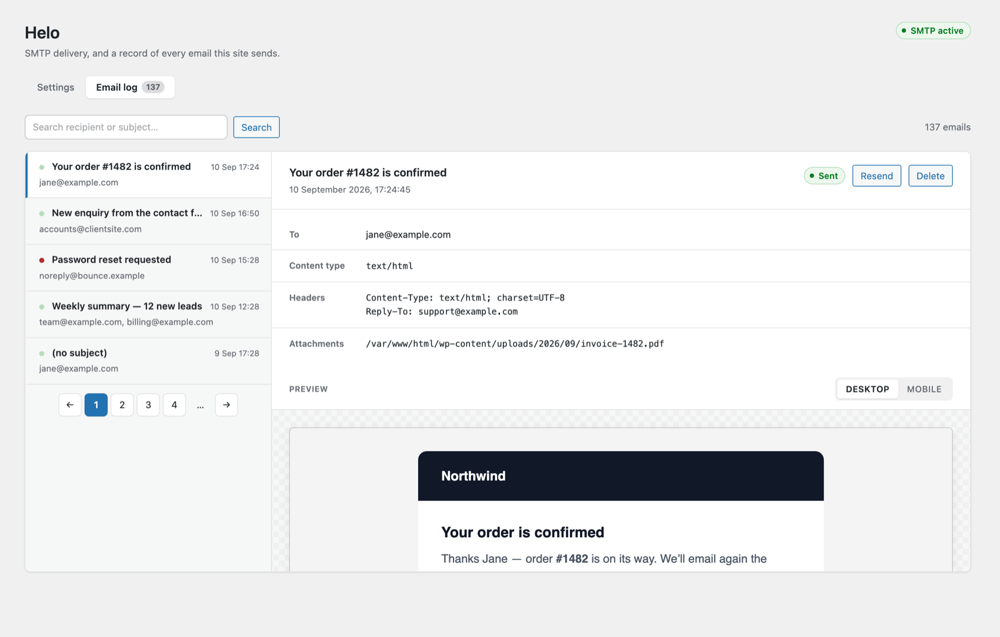
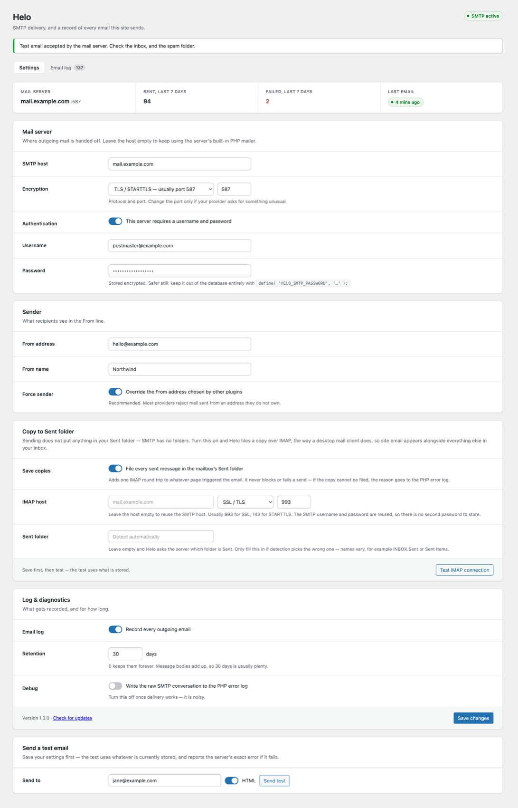
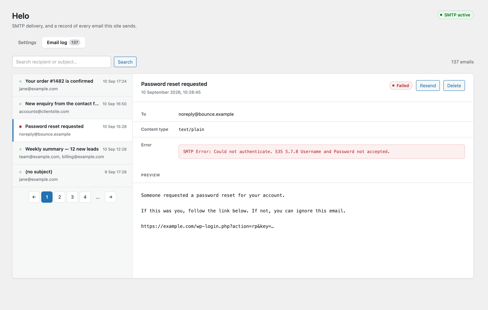

# Helo

**SMTP delivery for WordPress, and a record of every email your site sends.**

[](https://github.com/mkev07/helo/releases)
[](https://wordpress.org)
[](https://www.php.net)
[](LICENSE)

WordPress sends mail through PHP's `mail()` by default, which most hosts either
block or deliver straight to spam — and it keeps no record, so when a client
says "I never got the confirmation" there is nothing to check.

Helo fixes both halves. It routes everything through your own SMTP server, logs
every message with its full body, and gives you a mail-client view to read,
resend, and diagnose what went out.



---

## Features

### Delivery

- **One settings screen** for host, port, encryption, credentials and the From address.
- **Forces the sender**, overriding whatever address other plugins set — the usual reason a provider rejects your mail.
- **Test button** that reports the mail server's *actual* error, not a generic failure.
- **Password encrypted at rest**, with a key derived from the site's `AUTH_SALT`. Or keep it out of the database entirely with a constant in `wp-config.php`.
- **Optional SMTP debug** log, for when the error alone isn't enough.

### The log

- Records **every message that goes through `wp_mail()`** — contact forms, WooCommerce, password resets, everything.
- **Two-pane mail client view**: list on the left, the selected message on the right.
- **Full HTML preview** rendered in a sandboxed iframe, with a desktop/mobile width switcher.
- **Failures explained** — the SMTP error sits next to the message that failed.
- **Search** by recipient or subject, **resend** any message, **delete** individually.
- **Automatic cleanup** on a daily cron, so bodies don't pile up forever.

### Copy to Sent folder

Sending doesn't put anything in your Sent folder — SMTP has no concept of
folders. Gmail files a copy for you as a proprietary extra; ordinary mail
hosting does not.

Turn this on and Helo does what Thunderbird does: sends over SMTP, then opens a
separate IMAP connection and appends a copy to your mailbox, so site email shows
up in your normal mail client alongside everything else.

- Finds the Sent folder from the server's own **SPECIAL-USE flag**, so it works whether your host calls it `INBOX.Sent`, `Sent Items` or something in another language. Manual override available.
- Reuses your SMTP credentials — no second password to enter or store.
- **Never blocks or fails a send.** The mail has already gone out by the time this runs.
- Off by default, since it adds one IMAP round trip.

### Updates

Self-hosted. Updates arrive on the Plugins screen like any other, without being
listed on wordpress.org. See [Releasing](#releasing).

---

## Screenshots

| Settings | Reading a failed message |
|---|---|
|  |  |

---

## Installation

1. Download `helo-smtp-X.Y.Z.zip` from [Releases](https://github.com/mkev07/helo/releases).
2. **Plugins → Add New → Upload Plugin**, then activate.
3. Go to **Helo** in the admin menu, fill in your mail server details, save, and send a test.

### Keeping the password out of the database

Recommended. Add this to `wp-config.php` and the password field disappears from
the settings screen:

```php
define( 'HELO_SMTP_PASSWORD', 'your-password' );
```

### Common providers

| Provider | Host | Port | Encryption |
|---|---|---|---|
| Gmail / Workspace | `smtp.gmail.com` | 587 | TLS — use an [App Password](https://support.google.com/accounts/answer/185833) |
| Microsoft 365 | `smtp.office365.com` | 587 | TLS |
| Mailgun | `smtp.mailgun.org` | 587 | TLS |
| MXroute / DirectAdmin | your server hostname | 587 | TLS |

For the Sent-folder copy, IMAP is usually the **same host** on port **993** with
SSL/TLS. Leave the IMAP host blank and Helo reuses the SMTP one.

---

## Releasing

Distribution runs on GitHub releases via the `Update URI` header and the
`update_plugins_{$hostname}` filter WordPress 5.8 added for self-hosted plugins.
No update library, no wordpress.org listing.

The header points at GitHub's permanent latest-release redirect:

```
Update URI: https://github.com/mkev07/helo/releases/latest/download/update.json
```

`update.json` is attached to every release, so **publishing a release is
publishing the update** — there's no separate step to forget.

To ship a version:

1. Bump it in **three** places — `Version:` in the header, `HELO_VERSION` below it, and `Stable tag:` in `readme.txt`.
2. Add a `changelog` entry to `update.json`.
3. `./build.sh` — builds the zip and syncs the manifest.
4. Commit and push.
5. `./build.sh --publish` — tags, creates the release, uploads both files.

`build.sh` refuses to build if the three versions disagree or if the `Update URI`
header doesn't match the repo, and won't publish from a dirty or unpushed tree.

> [!IMPORTANT]
> The repository must stay public. WordPress fetches the manifest and the zip
> with no credentials, and a private repo's release assets reject that.

---

## Development

```bash
php helo-smtp/tests/test-settings.php   # password encryption, sanitising
php helo-smtp/tests/test-imap.php       # IMAP protocol, against a fake server
./build.sh                              # build the zip
```

No framework — plain `assert()` scripts, excluded from the released zip.

`preview/` renders the real admin views against stubbed WordPress functions, so
the interface can be checked without an install:

```bash
php preview/render.php && open preview/settings.html
```

### Layout

```
helo-smtp/
├── helo-smtp.php               header, constants, wiring
├── uninstall.php               removes table + options on delete
├── includes/
│   ├── class-helo-settings.php defaults, sanitising, password encryption
│   ├── class-helo-mailer.php   phpmailer_init, From override, test, resend
│   ├── class-helo-logger.php   schema, record, query, retention cron
│   ├── class-helo-imap.php     Sent-folder copy over raw IMAP
│   └── class-helo-updater.php  self-hosted updates
├── admin/
│   ├── class-helo-admin.php    menu, routing, form handlers
│   ├── css/admin.css
│   └── views/                  settings, logs, message
└── tests/
```

---

## Notes

- Plugins that call an email API directly instead of `wp_mail()` — SendGrid's and Mailgun's own plugins, for instance — bypass WordPress entirely and won't appear in the log.
- The IMAP client is written against raw sockets rather than PHP's `imap` extension, which is often missing and was unbundled from core in PHP 8.4.
- Message previews render in a `sandbox=""` iframe, so a hostile email body can't reach wp-admin.

## License

GPL-2.0-or-later. See [readme.txt](helo-smtp/readme.txt) for the WordPress-format
readme, changelog and FAQ.
